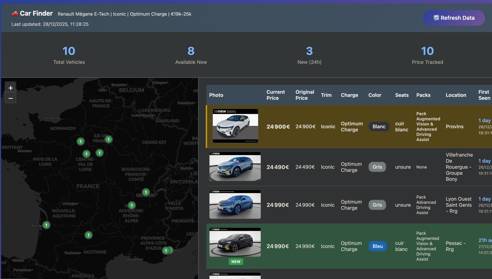

# Renault Vehicle Scraper

A web-based scraper that monitors Renault vehicle listings, tracks price changes, and provides a real-time dashboard.

## Features

- 🚗 Scrapes Renault vehicle listings automatically
- 💰 Tracks price history and changes
- 📍 Displays vehicle locations on an interactive map
- 📊 Real-time scraping progress and statistics
- 🔄 Web interface with live updates
- 💾 SQLite database for persistent storage

## Tech Stack

- **Backend**: Flask (Python)
- **Frontend**: Vanilla JavaScript
- **Database**: SQLite
- **Scraping**: Custom scraper with progress tracking

---

*vibe coded* ✨
